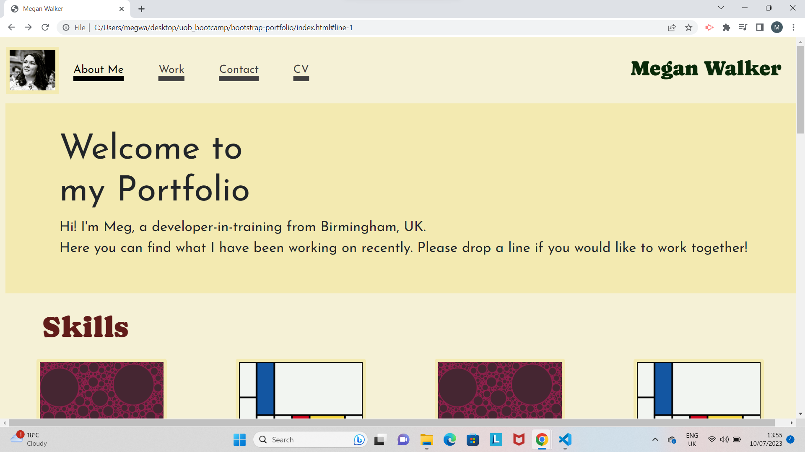
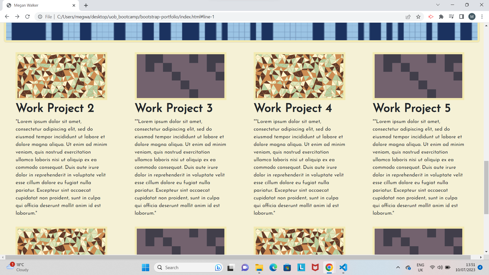

# bootstrap-portfolio

This project is for a portfolio page which has been made using Bootstrap 5 elements to help make it responsive. I have kept the structure quite simple, using a header, jumbtron, grid gallery and small footer for contact links. I will continue to update and develop this page as I make new projects.

I used elements and code from Bootstrap 5 to make this project, adapting the structure and styling to personalise it. 

https://getbootstrap.com/

I have also used placeholder images from the below website:

https://generative-placeholders.glitch.me/#palettes

